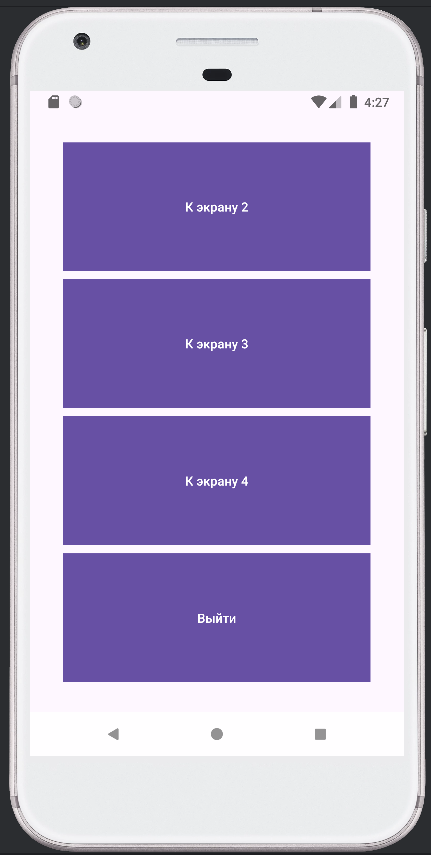
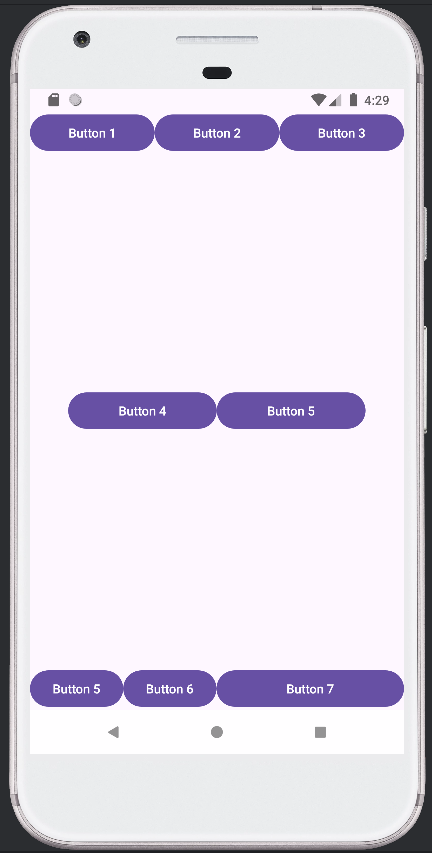
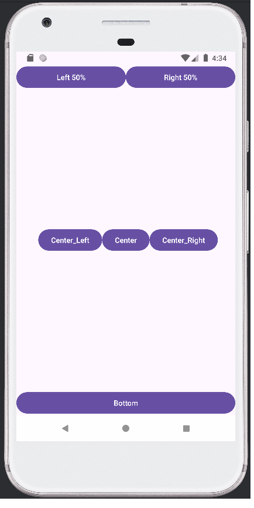
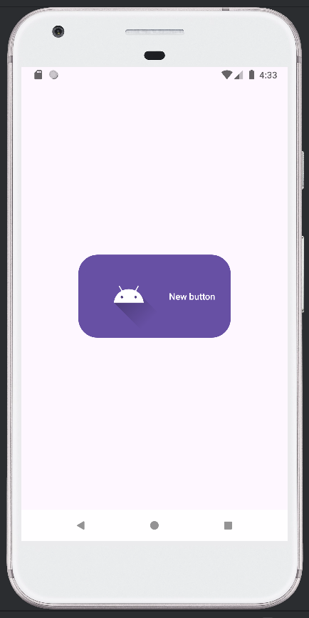

# Лабораторная работа №2: Основы верстки
---
Выполнила: **Мызникова Анастасия**  
Язык программирования: **Java**
---
## Описание приложения

Приложение Android имеет четыре экрана (Activity_main, Activity_main2, Activity_main3 и Activity_main4).
На первом экране (Activity_main) содержится 4 кнопки, 3 из которых переходят на следующие экраны и кнопка выхода.
Второй экран сверстан с использованием LinearLayout, состоит из 7 кнопок с разным расположением на экране.
Третий экран сверстан с использованием RelativeLayout, состоит из 6 кнопок с разным расположением на экране.
Четвёртый экран содержит кнопку, которая должна быть зелёной.

---
## Скриншоты

---
# Установка и запуск приложения

Следуйте этим инструкциям, чтобы установить и запустить приложение на своем компьютере.

## Требования

- Установленный [Java JDK](https://www.oracle.com/java/technologies/javase-jdk11-downloads.html) (версия 11 или выше)
- Установленный [Android Studio](https://developer.android.com/studio) (для Android-приложений)

## Установка

1. **Склонируйте репозиторий:**
2. **Перейдите в папку проекта:**
3. **Настройте проект:**
4. **Установите необходимые зависимости:**

## Запуск

1. **Запустите Android-эмулятор или подключите устройство:**
    - Создайте эмулятор в Android Studio через AVD Manager или подключите Android-устройство через USB.

2. **Запустите приложение:**

   Нажмите на кнопку "Run" (Зеленая треугольная кнопка) в Android Studio.